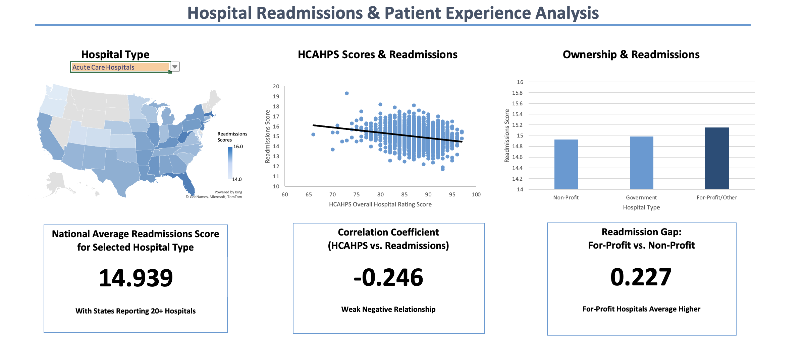

# Hospital 30-Day Readmissions Analysis

**Project Title:** Hospital 30-Day Readmissions Analysis  
**Author:** Yashkirat Singh  
**Date:** June 2026 - August 2026
**Repository:** hospital-readmissions-analysis
**Tools:** Excel · XLOOKUP · AVERAGEIFS/COUNTIFS · CORREL · QUARTILE.INC · Filled Map & Scatter Charts

---

## Summary

This project analyzes CMS public data on U.S. hospital 30-day readmission rates to answer whether geography, ownership type, and patient experience scores are associated with readmission outcomes. This analysis finds a weak relationship between patient experience scores and readmission outcomes, with geography and ownership type telling a clearer story.

---

## Key Findings

1. Patient experience and readmissions show a weak negative relationship. The correlation between HCAHPS overall hospital rating scores and the hybrid hospital-wide readmission rate came out to r = -0.246. Higher-rated patient experience is modestly associated with lower readmissions, but the relationship is too weak to treat experience scores as a reliable predictor on its own.
2. Readmission performance varies by state. States were ranked into quartiles by readmission rate, surfacing clear top and bottom performers. [Highest readmission scores for acute care hospitals: Massachusetts (15.616), West Virginia (15.545), and Florida (15.518). Highest readmission scores for critical access hospitals: Illinois (15.117), Arkansas (15.104), and Kentucky (15.061)]
3. For-profit hospitals average higher readmission rates than nonprofit and government-owned facilities with a gap of 0.227 between For-profit and non-profit readmission scores. This is a structural pattern worth flagging. Ownership type isn't something a hospital can change, so it's best read as a diagnostic signal rather than a fix.
4. Data reliability varies by state. States with fewer than 20 reporting hospitals were retained in the dataset but flagged as statistically unreliable and not included in state-level comparisons.

---

## Recommendations

This analysis found that hospital readmission performance varies by state and hospital type. For acute care hospitals, Massachusetts, West Virginia, and Florida showed the highest readmission rates with admission scores of 15.616, 15.545, and 15.518 respectively. For critical access hospitals, Illinois, Arkansas, and Kentucky had the highest readmission scores at 15.117, 15.104, and 15.061 respectively. Only states reporting 20+ hospitals for each hospital type were included in the analysis. Hospitals in these states should prioritize investigating their readmission processes first, as this was the clearest and most actionable finding in the analysis. Hospital ownership type shows a small but consistent gap. For-profit hospitals average readmission scores 0.227 points higher than government-owned facilities. While this difference is modest, hospitals in the lower-performing groups may benefit from examining how higher-performing hospitals are structured or operated differently. Patient experience, measured via HCAHPS ratings for overall hospital score, shows a weak negative correlation with readmissions (r = -0.246). This weak relationship is not strong enough to justify major investment into patient survey ratings, though the direction is consistent with the idea that hospital quality may play a role in readmission rates. Future analysis using more specific HCAHPS measures, such as doctor and nurse communication, could result in a stronger relationship. Overall, a hospital looking to reduce readmission rates should start with state-level and type-level benchmarking against peers, treat ownership through a secondary diagnostic lens, and view patient experience improvements as a longer-term, lower-priority diagnostic pending further study. 

---

## Dashboard



---

## Repository Structure

```
hospital-readmissions-analysis/
├─ data/
│  ├─ raw/
│     ├─ HCAHPS-Hospital.csv
│     ├─ Hospital_General_Information.csv
│     ├─ Unplanned_Hospital_Visits-Hospital.csv
│     └─ HOSPITAL_Data_Dictionary.pdf
│  ├─ clean/
│     ├─ cleaned_table.xlsx
│
├─ dashboard/
│  ├─ readmissions-analysis.xlsx
│
├─ screenshots/
│  ├─ dashboard.png
│
└─ README.md
```

---

## Data Sources

- CMS Provider Data Catalog — data.cms.gov/provider-data/topics/hospitals
    - Hospital General Information
    - Unplanned Hospital Visits (Hybrid Hospital-Wide All-Cause Readmission Rate)
    - Patient Survey (HCAHPS)
Download date: June 22, 2026
All data is public domain, published by the Centers for Medicare & Medicaid Services.

---

## Methodology

Each downloaded file was imported as an Excel Table and joined on Facility ID, a 6-digit code that Excel silently strips leading zeros from on import. This was handled by keeping the field as text throughout the analysis. A clean master table was built with XLOOKUP pulling readmission and HCAHPS values onto hospital-level records. A handful of joins were spot-checked by hand to confirm accuracy. Rows with suppressed or "Not Available" values (common for low-volume hospitals) were retained but excluded from calculations rather than deleted, with counts cross checked against total rows so nothing was dropped. Outlier and performance flags were defined using quartiles (QUARTILE.INC) rather than fixed thresholds, and states with fewer than 20 reporting hospitals were flagged as statistically unreliable and not included in state-level comparisons.

---

## Skills Used
Tables -> Imported each CMS CSV as a structured Excel Table

Text functions -> Fixed leading-zero CCNs, standardized state codes

Logical functions -> IF/AND-based over/under-performer flags, handled "Not Available" codes

Lookup functions -> XLOOKUP joins across files on Facility ID

Statistical functions -> AVERAGE, CORREL, QUARTILE.INC for distribution and relationship analysis

Conditional aggregation -> AVERAGEIFS / COUNTIFS to summarize by state and ownership type

Charts -> Filled map, scatter plot with trendline, ownership bar chart

Collaboration -> Sheet protection and hidden non-dashboard sheets on the final dashboard

---

## Limitations

1. CMS readmission measures are already risk-adjusted; this analysis compares reported, adjusted performance, not raw outcomes. This analysis is correlational, not causal, with findings described as "associated with," not "caused by".
2. A weak correlation (r = -0.246) between overall hospital rating according to patient experience does not establish a strong relationship, nor rule out a real relationship.
3. Suppressed ("No Match") / "Not Available" values being excluded from calculations was my own judgment call.
4. State-level comparisons for states with fewer than 20 reporting hospitals should be read with caution due to small sample sizes.

---

*This repository contains all final data, analyses, and figures from the project.*  
*For inquiries, contact Yash Singh at yashksingh43@gmail.com.*
